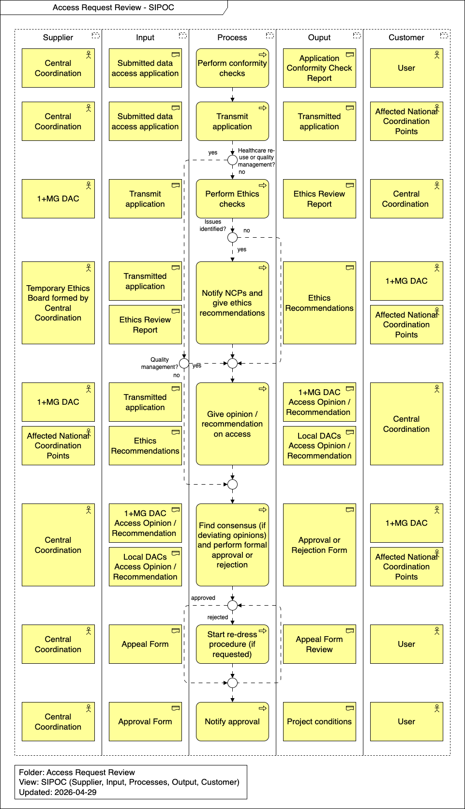

import TOCInline from '@theme/TOCInline';

# Runtime View

This section details the dynamic behavior and specific scenarios involved in the Access Request Review process. It outlines the operational steps, ethical checks, and consensus-building required to evaluate and approve or reject data access applications.

<TOCInline toc={toc} />

## Overview

## Perform conformity checks

Central Coordination performs initial conformity checks on the submitted data access application to ensure all requirements are met, generating an Application Conformity Check Report for the User.

## Transmit application

Once conformity is verified, Central Coordination transmits the submitted data access application to the Affected National Coordination Points for awareness and further processing.

## Perform Ethics checks

For requests that are not related to healthcare re-use or quality management, the 1+MG DAC performs ethics checks on the transmitted application, producing an Ethics Review Report for Central Coordination.

## Notify NCPs and give ethics recommendations

If issues are identified during the ethics checks, a Temporary Ethics Board formed by Central Coordination uses the transmitted application and Ethics Review Report to notify National Coordination Points and provide Ethics Recommendations to the 1+MG DAC and Affected National Coordination Points.

## Give opinion / recommendation on access

Unless the request is solely for quality management (which bypasses this step), the 1+MG DAC and Affected National Coordination Points review the transmitted application alongside any Ethics Recommendations to formulate their decision. This process generates the 1+MG DAC Access Opinion / Recommendation and Local DACs Access Opinion / Recommendation for Central Coordination.

## Find consensus (if deviating opinions) and perform formal approval or rejection

Central Coordination gathers the various access opinions and recommendations. If there are deviating opinions, they facilitate a process to find consensus before performing the formal approval or rejection of the request. The resulting Approval or Rejection Form is then shared with the 1+MG DAC and Affected National Coordination Points.

## Start re-dress procedure (if requested)

In the event of a rejection, the User may submit an Appeal Form. Central Coordination will then start a re-dress procedure to review the appeal, producing an Appeal Form Review for the User.

## Notify approval

If the request is approved, Central Coordination uses the Approval Form to formally notify the User of the approval, generating the final Project Definition.
