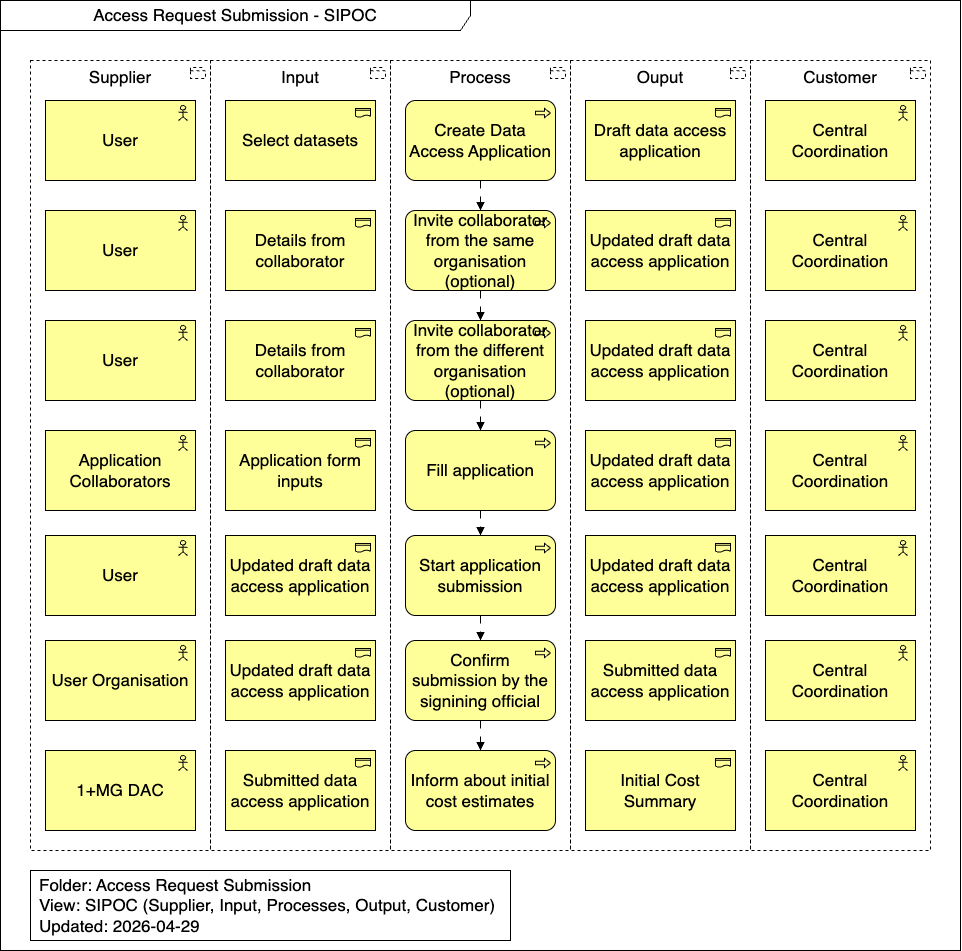

import TOCInline from '@theme/TOCInline';

# Runtime View

This section details the dynamic behavior and scenarios involved in the Access Request Submission process. It outlines the step-by-step workflows and interactions required to successfully submit an application for data access within the network.

<TOCInline toc={toc} />

## Overview

## Create Data Access Application

A user initiates the access request by selecting the desired datasets and creating a draft data access application. This draft serves as the foundational document where all requirements, research goals, and required data variables will be detailed.

## Invite collaborator from the same organisation (optional)

If the research project involves multiple individuals from the same organisation, the primary user can invite them as collaborators. These collaborators can then contribute to filling out and reviewing the data access application.

## Invite collaborator from the different organisation (optional)

For cross-organisational research projects, the primary user has the option to invite external collaborators. This facilitates joint research efforts by allowing members from different vetted organisations to collaborate on a single data access application.

## Fill application

The user, along with any invited collaborators, provides the necessary details within the application form. This includes specifying the research purpose, methodology, requested datasets, and ensuring all ethical and legal requirements are addressed.

## Start application submission

Once the application is fully completed, the user initiates the submission process. This action typically forwards the finalized draft to the user organisation's signing official for formal approval before it reaches the data access committee.

## Confirm submission by the signing official

The designated signing official from the user organisation reviews the application. By confirming the submission, the official provides organizational endorsement, verifying that the request aligns with the organisation's policies and the terms of service.

## Inform about initial cost estimates

Upon receiving the submitted application, the 1+MG DAC reviews the request and provides the user with an initial estimate of the costs associated with data provisioning, processing, or egress, allowing the user to secure necessary funding or approvals.
