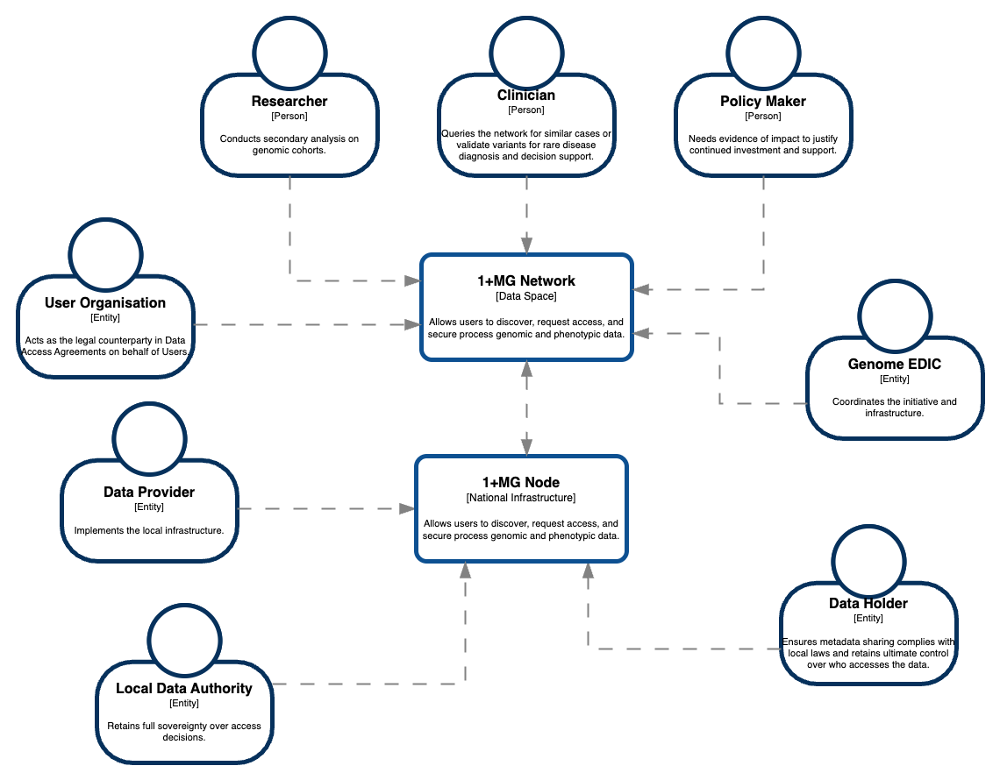

# Context and Scope

## Business Context

The **1+MG Infrastructure** operates as a federated network. It does not store data centrally; instead, it orchestrates access between **Data Users** and **Data Holders** across National borders.

**System Context Diagram:**

### Communication Partners

| Role                                  | Interaction                                                                         | Input/Output                                                                  |
| :------------------------------------ | :---------------------------------------------------------------------------------- | :---------------------------------------------------------------------------- |
| **Data User**                         | Accesses data for Research, Policy, Quality, or Healthcare purposes.[^22]           | **In:** Query / WES Workflow **Out:** Analysis Result / Feasibility Count |
| **Data Subject**                      | The individual whose data is processed.                                             | **In:** Consent / Transparency Info **Out:** Rights (Object/Withdraw)     |
| **Data Authority (DAC)**              | Approves/Denies access requests.                                                    | **In:** Access Application **Out:** Approval Token                        |
| **Data Provider**                     | The Controller determining purpose/means and making data available.[^22]            | **In:** Data Management Plan **Out:** Dataset Inclusion                   |
| **Data Holder**                       | The entity physically holding the data (Processing/Hosting).[^22]                   | **In:** Encrypted Storage **Out:** Data Stream to Compute                 |
| **National Coordination Point (NCP)** | Coordinates national stakeholders and serves as contact point.[^22]                 | **In:** National Policy **Out:** Governance Reporting                     |
| **Genome EDIC**                       | The legal entity governing the infrastructure (distinct from the software service). | **In:** Governance Policies **Out:** Compliance Audit Reports             |
| **Research Communities**              | Specialized groups (e.g., Cancer, Infectious Disease, Genome of Europe).            | **In:** Specific Analysis Pipelines **Out:** Domain-specific Insights     |

### External Systems

| System                                | Description                                                                         | Interaction                                                                   |
| :------------------------------------ | :---------------------------------------------------------------------------------- | :---------------------------------------------------------------------------- |
| **Global Genomic Resources**          | Non-EU biobanks (e.g., UK Biobank, All of Us, H3Africa).                            | **In:** Metadata Interoperability (Benchmarking) **Out:** Comparative Cohorts |

## Technical Context

The system relies on secure internet-based channels using standard genomic protocols.

### Channels & Protocols

| Channel           | Protocol                                     | Port | Usage                                                                      |
| :---------------- | :------------------------------------------- | :--- | :------------------------------------------------------------------------- |
| **Discovery API** | HTTPS / GA4GH Beacon v2                      | 443  | Public/Registered search for variant availability.                         |
| **Access API**    | HTTPS / OIDC / GA4GH Passport                | 443  | Authentication and Authorization Claims transfer.                          |
| **Compute API**   | HTTPS / GA4GH WES (Workflow Execution)       | 443  | Submission of containerized pipelines (Nextflow/Snakemake) to Nodes.       |
| **Data API**      | HTTPS / GA4GH htsget / DRS (Data Repository) | 443  | Streaming genomic data (BAM/CRAM/VCF) to authorised local compute buffers. |
| **Trust Anchor**  | PKI / eIDAS                                  | -    | Verification of Node identity and User identity.                           |

### Technical Constraints

- **No Raw Data Egress:** Raw genomic data files (VCF/BAM) must **never** leave the secure perimeter of the National Node (except for specific authorized download scenarios, which are rare).
- **Federated Identity:** Users authenticate via their Home Organisation (LS AAI / LifeScience RI), not a central DB.
- **Data Sovereignty:** Integration with Global Resources must respect EU data transfer regulations (GDPR Chapter V).

[^22]: Masterdocument data governance. (extracted from Masterdocument_data-governance_recovered-formatting.docx)
