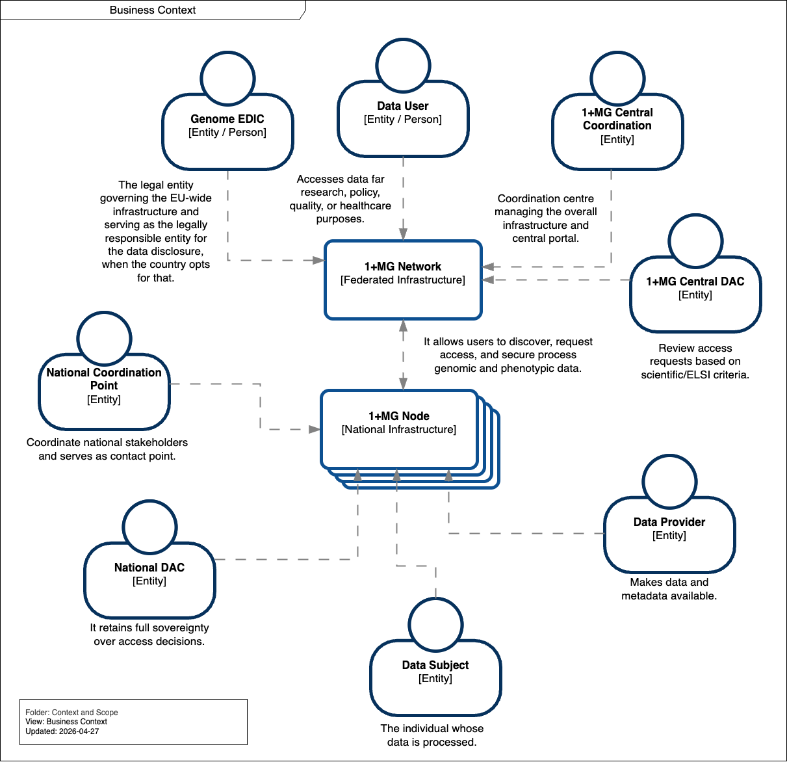
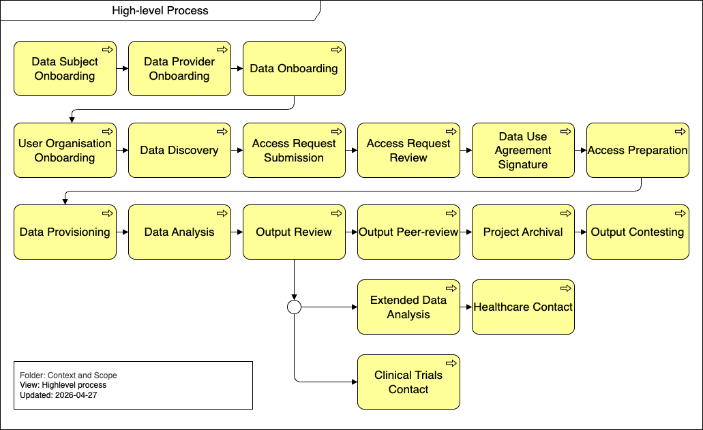

# Context and Scope

## Business Context

The **1+MG Network** operates as a federated network. It does not store data centrally; instead, it orchestrates access between **Data Users** and **Data Holders** across National borders.

### Communication Partners

| Role                                  | Interaction                                                                         | Input/Output                                                                  |
| :------------------------------------ | :---------------------------------------------------------------------------------- | :---------------------------------------------------------------------------- |
| **Data User**                         | Accesses data for Research, Policy, Quality, or Healthcare purposes.[^22]           | **In:** Query / WES Workflow **Out:** Analysis Result / Feasibility Count |
| **Data Subject**                      | The individual whose data is processed.                                             | **In:** Consent / Transparency Info **Out:** Rights (Object/Withdraw)     |
| **Helpdesk (Virtual)**                | Single point of contact for technical and procedural support.[^28]                  | **In:** Incident Ticket **Out:** Resolution / Guidance                    |
| **1+MG Central DAC**                  | Reviews cross-border access requests based on scientific/ELSI criteria.[^30]        | **In:** Access Application **Out:** Recommendation / Decision             |
| **National DAC**                      | Reviews access requests for national compliance, retains veto power.[^30]           | **In:** Central Recommendation **Out:** Veto / Validation                 |
| **1+MG CC**                           | Coordination Centre managing the overall infrastructure and central portal.[^22]    | **In:** aggregated metrics **Out:** Guidance / SOPs                       |
| **Data Provider**                     | The Controller determining purpose/means and making data available.[^22]            | **In:** Data Management Plan **Out:** Dataset Inclusion                   |
| **Data Holder**                       | The entity physically holding the data (Processing/Hosting).[^22]                   | **In:** Encrypted Storage **Out:** Data Stream to Compute                 |
| **National Coordination Point (NCP)** | Coordinates national stakeholders and serves as contact point.[^22]                 | **In:** National Policy **Out:** Governance Reporting                     |
| **Genome EDIC**                       | The legal entity governing the infrastructure (distinct from the software service). | **In:** Governance Policies **Out:** Compliance Audit Reports             |

### Governance Context

The 1+MG Network operates under a specific governance framework designed to balance cross-border efficiency with national sovereignty.[^30] It is anchored by the **Transnational Code of Conduct** to bridge legal gaps.

**The high-level process:** [^30]

1. **Data Inclusion**
   1. **Data Provider Onboarding**: Registering and validating organizations that supply data to the network.
   1. **Data Subject Onboarding**: Managing patient/subject consent and transparency for their data inclusion.
   1. **Data Onboarding**: Ingesting, harmonizing, and securely storing datasets within a node.
1. **Data Access**
   1. **User Organisation Onboarding**: Registering and verifying user organizations applying for data access.
   1. **Data Discovery**: Enabling users to search and identify relevant datasets across the federated network.
   1. **Access Request Submission**: Allowing users to submit detailed applications to access specific datasets.
   1. **Access Request Review**: Central and National DACs evaluating the request based on scientific, ethical, and compliance criteria.
   1. **Data Use Agreement Signature**: Formalizing the data access agreement between the user and data providers.
   1. **Access Preparation**: Setting up the secure processing environment and configuring permissions.
1. **Data Use**
   1. **Data Provisioning**: Making the requested data securely available to the authorized user's environment.
   1. **Data Analysis**: Users executing analytical workflows on the provisioned data within the secure environment.
   1. **Extended Data Analysis**: Requesting additional time or resources to complete ongoing analyses.
   1. **Clinical Trial Contact**: Re-contacting data subjects for potential participation in clinical trials, if consented.
   1. **Output Review**: Reviewing analysis results to ensure no sensitive or re-identifying information is exported.
   1. **Output Peer-review**: Academic or scientific evaluation of the final research outputs.
   1. **Project Archival**: Securely closing the project, archiving logs and the compute environment.
   1. **Output Contesting**: Handling disputes regarding denied outputs or access decisions.
   1. **Healthcare Contact**: Informing data subject's healthcare provider of actionable incidental findings or requesting for further information.

However, evaluations highlight significant existing fragmentation:

- **National Silos:** Some infrastructures risk becoming silos due to local language requirements or strict national certification demands for compute environments.[^11]
- **Ethics Fragmentation:** There is currently no EU-wide harmonised ethical approval procedure; decisions are made on a case-by-case basis.[^11]

- **Single Access Principle:** Users submit one application through a central portal, which is reviewed by a central 1+MG Data Access Committee (DAC).
- **National Veto:** While the central DAC provides a recommendation/decision, the ultimate decision remains with the Data Providers/National DACs, who retain a right of veto.
- **Controller Relationships:**
  - **Data Provider:** Acts as **Controller** for data inclusion, storage, and making data available.
  - **Data User:** Acts as **Controller** for the processing of data for their specific research purpose.
  - **1+MG Network:** Acts as **Processor** providing the secure environment and tools.
  - **1+MG CC/DAC:** Acts as **Joint Controller** (with Data Providers) for the data disclosure process (provision of access).

### EHDS Alignment

The 1+MG Network is designed to align with the European Health Data Space (EHDS). In the context of EHDS, 1+MG nodes and the central infrastructure aim to function as an **Authorised Participant** in the HealthData@EU infrastructure.[^30]

- **Data Holder Role**: 1+MG nodes fulfill the obligations of "Data Holders" under EHDS (making data available).
- **Secure Processing**: The 1+MG Secure Processing Environments (SPEs) align with EHDS requirements for Secure Processing Environments.

[^22]: Masterdocument data governance. (extracted from Masterdocument_data-governance_recovered-formatting.docx)

[^28]: GDI Deliverable D4.1 - Helpdesk roadmap. (https://zenodo.org/records/8017873)

[^30]: B1MG Deliverable D2.4 - Report on data access and governance framework. (https://zenodo.org/records/8411102)

[^11]: GDI Deliverable D2.9 - Evaluation of data governance experiences - Report. (https://zenodo.org/records/10069814)
