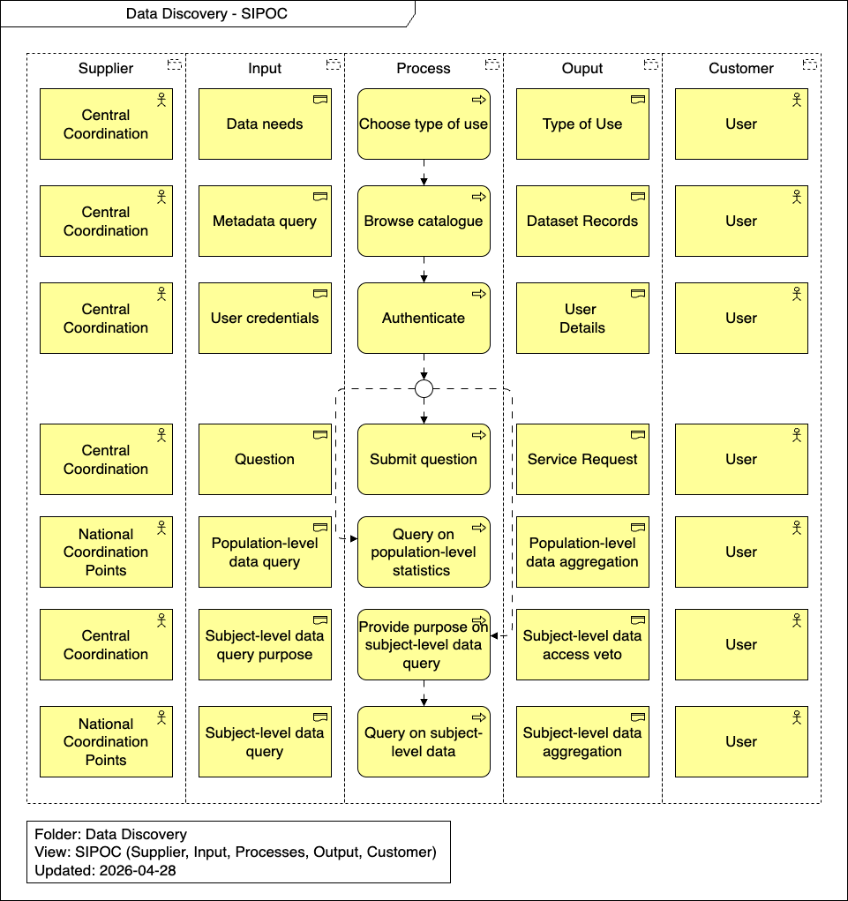

import TOCInline from '@theme/TOCInline';

# Runtime View

This section details the dynamic behavior and scenarios involved in the Data Discovery process. It outlines the step-by-step workflows required for users to explore available datasets, authenticate, and perform various queries ranging from population-level statistics to subject-level data access.

<TOCInline toc={toc} />

## Overview

## Choose type of use

The User interacts with the Central Coordination system to define their specific data needs, selecting the appropriate type of use for their research or query.

## Browse catalogue

Based on a metadata query, the User browses the central catalogue. The Central Coordination system processes the query and returns the relevant Dataset Records for the User to review.

## Authenticate

To access more specific data or submit inquiries, the User must authenticate. They provide their user credentials to the Central Coordination system, which verifies and returns their authenticated User Details.

## Submit question

If the User needs assistance or has specific inquiries, they can submit a question. A Service Desk Operator processes this input and generates a Service Request for the User.

## Query on population-level statistics

The User can execute a population-level data query. The National Coordination Point processes this query and returns a population-level data aggregation to the User.

## Provide purpose on subject-level data query

For access to granular data, the User must provide the purpose of their subject-level data query to the Central Coordination. This step evaluates the request and outputs a subject-level data access veto (decision) back to the User.

## Query on subject-level data

Following approval, the User submits a subject-level data query. The National Coordination Point processes this detailed query and returns the subject-level data aggregation to the User.
