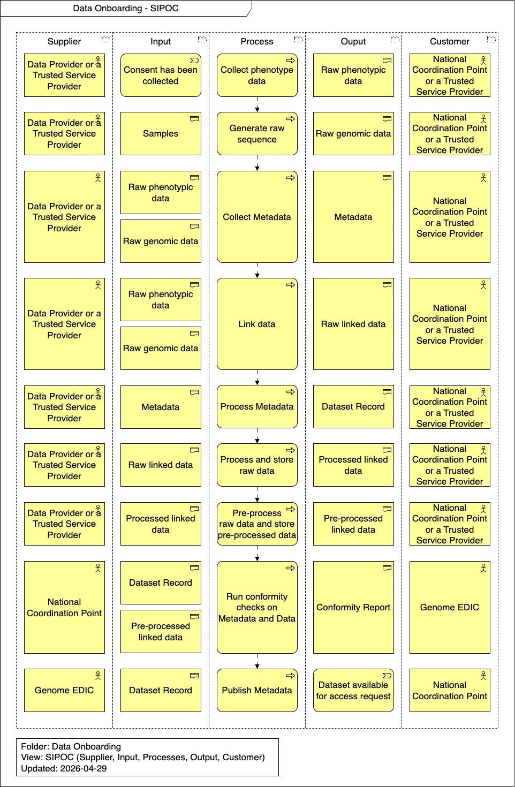

import TOCInline from '@theme/TOCInline';

# Runtime View

This section details the dynamic behavior and scenarios involved in the Data Onboarding process. It outlines the step-by-step workflows required for data providers to integrate their datasets into the federated network, ensuring proper governance, cataloging, and availability for research purposes.

<TOCInline toc={toc} />

## Overview

## Collect phenotype data

Gathering associated clinical, demographic, and phenotypic information related to the data subjects. This data is typically sourced from electronic health records, clinical trials, or structured questionnaires.

## Generate raw sequence

Processing the prepared biological samples through high-throughput sequencing instruments. This step yields the foundational raw genomic sequence data (e.g., FASTQ files) that will undergo further bioinformatic processing.

## Collect Metadata

Capturing comprehensive, structured metadata that describes the study context, sequencing protocols, sample provenance, and consent codes. This is essential for making the resulting datasets FAIR (Findable, Accessible, Interoperable, and Reusable).

## Link data

Securely associating the raw genomic sequence files with their corresponding raw phenotypic data using robust identifiers to protect data subject privacy, creating raw linked data.

## Process Metadata

Harmonizing, mapping, and cleaning the collected metadata to ensure it aligns perfectly with standard 1+MG data models, semantic ontologies, and required schemas, generating a Dataset Record.

## Process and store raw data

Securely ingesting, processing, and archiving the raw linked data within the Data Provider's or National Node's secure storage infrastructure, establishing a primary data backup.

## Pre-process raw data and store pre-processed data

Executing standardized bioinformatics pipelines (such as alignment, quality control, and variant calling) to convert raw linked data into usable, standardized formats (e.g., BAM/CRAM, VCF). Saving the cleaned, standardized, and analysis-ready datasets in the active secure storage environment, staging them for discovery and authorized researcher access.

## Run conformity checks on Metadata and Data

Executing automated validation tools and quality assurance scripts to verify that both the pre-processed datasets and the Dataset Record strictly comply with 1+MG technical standards, data models, and quality thresholds.

## Publish Metadata

Securely transferring the validated Dataset Record to the central 1+MG / Genome EDIC catalog, officially registering the dataset and making it available for access requests.
