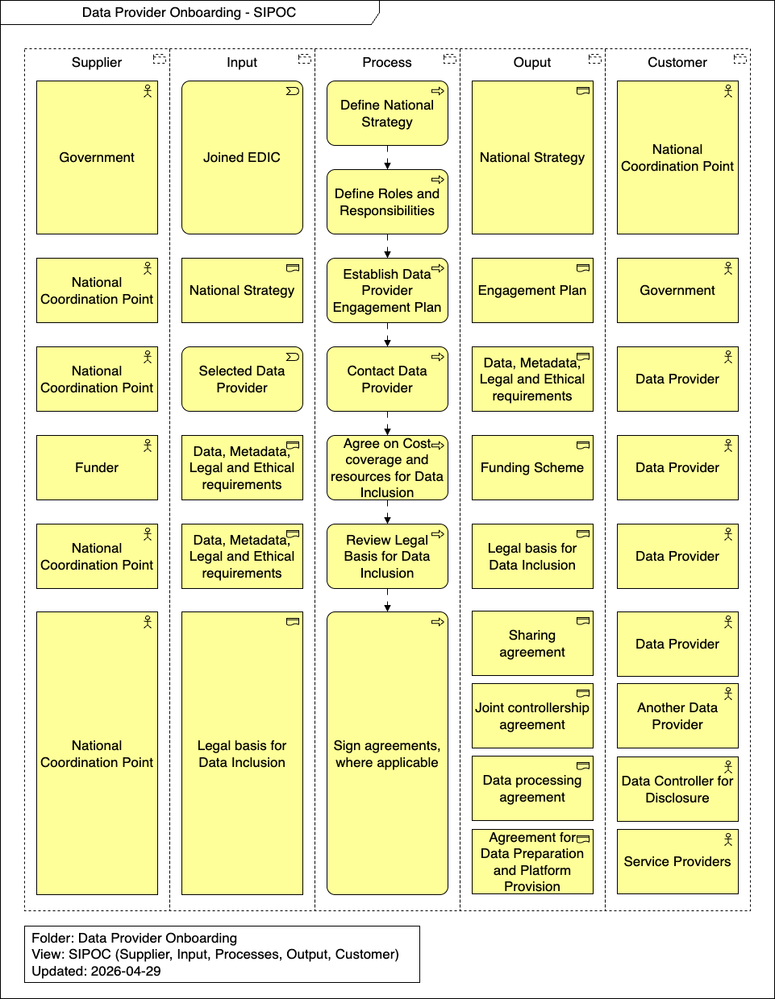

import TOCInline from '@theme/TOCInline';

# Runtime View

This section describes the dynamic behavior and specific scenarios involved in the Data Provider Onboarding process. It outlines the strategic, legal, and operational steps required to successfully engage, assess, and formalize agreements with new data providers joining the federated network.

<TOCInline toc={toc} />

## Overview

## Define National Strategy

The Government and the National Coordination Point define the overarching national strategy for genomic data sharing, aligning local objectives with the broader 1+MG framework.

## Define Roles and Responsibilities

Governance is established by clearly defining the roles, obligations, and interactions of all stakeholders involved, including the National Coordination Point, Data Providers, and Data Controllers.

## Establish Data Provider Engagement Plan

A structured plan is developed by the National Coordination Point to systematically identify, prioritize, and approach potential genomic data providers within the national healthcare and research ecosystems.

## Contact Data Provider

The National Coordination Point officially reaches out to the identified institutions to initiate the onboarding discussion, presenting the value proposition and requirements for joining the federated network.

## Agree on Cost coverage and resources for Data Inclusion

Negotiations take place with Funders and relevant stakeholders to secure the necessary financial and technical resources required to cover the costs associated with data preparation, harmonization, and long-term storage.

## Review Legal Basis for Data Inclusion

A thorough legal assessment is conducted to ensure the Data Provider has the appropriate lawful basis (e.g., under GDPR) to legitimately process and share the genomic and phenotypic data.

## Sign agreements, where applicable

Based on the established legal basis, foundational legal and operational documents are executed to formally define responsibilities for data sharing, protection, and processing. Depending on the specific context, this involves several distinct agreements:

- **Sharing agreement**: Executed with the Data Provider.
- **Joint controllership agreement**: Executed with Another Data Provider to formally establish joint responsibilities for data protection, security, and data subject rights.
- **Data processing agreement**: A formal Data Processing Agreement (DPA) is signed with the Data Controller for Disclosure.
- **Agreement for Data Preparation and Platform Provision**: Operational agreements are executed with Service Providers, authorizing the commencement of data harmonization, technical preparation, and the provisioning of the secure platform infrastructure for the newly onboarded data.
