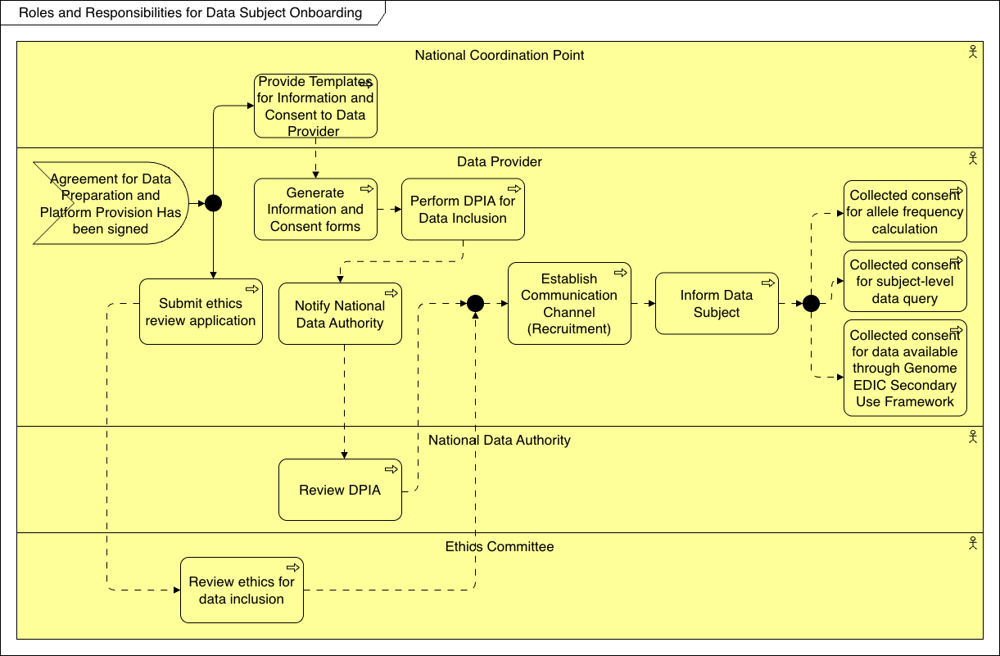

import TOCInline from '@theme/TOCInline';

# Runtime View

This section describes the dynamic behavior and specific scenarios involved in the Data Subject Onboarding process. It outlines the ethical, legal, and operational steps required to ensure that data subjects are properly informed, consented, and onboarded into the federated network in full compliance with privacy regulations.

<TOCInline toc={toc} />

## Overview

## Provide Templates for Information and Consent to Data Provider

The National Coordination Point provides the Data Provider with standardized, legally compliant templates for patient information sheets and informed consent forms, ensuring consistency across the network.

## Generate Information and Consent forms

The Data Provider customizes the provided templates to generate the final information sheets and consent forms specific to their cohort, study, or clinical environment.

## Submit ethics review application

The Data Provider submits the generated information and consent forms, along with the study protocol, to the relevant Ethics Committee for official review and approval.

## Review ethics for data inclusion

The Ethics Committee thoroughly reviews the application to ensure that the proposed data inclusion and secondary use of the data subjects' genomic information meet all strict ethical standards.

## Perform DPIA for Data Inclusion

The Data Provider performs a Data Protection Impact Assessment (DPIA) to identify, assess, and mitigate any privacy risks associated with processing and sharing the data subjects' sensitive health and genomic data.

## Notify National Data Authority

The Data Provider notifies the National Data Authority (or Data Protection Authority) regarding the data processing activities and the outcomes of the DPIA, ensuring regulatory transparency.

## Review DPIA

The National Data Authority or relevant supervisory body reviews the submitted DPIA to confirm that all data protection risks have been adequately addressed and that the processing complies with GDPR and national laws.

## Establish Communication Channel (Recruitment)

The Data Provider establishes secure and appropriate communication channels to reach out to potential data subjects for recruitment and to provide them with the necessary information about the initiative.

## Inform Data Subject

The Data Provider officially informs the data subject about how their genomic and phenotypic data will be used, stored, and shared within the 1+MG federated network, using the approved information sheets.

## Collected consent for allele frequency calculation

The data subject provides explicit consent specifically allowing their genomic data to be aggregated and used for calculating allele frequencies across the population.

## Collected consent for subject-level data query

The data subject provides explicit consent allowing authorized researchers to query and access their individual, subject-level genomic and phenotypic data within a secure processing environment.

## Collected consent for data available through Genome EDIC Secondary Use Framework

The data subject provides explicit, overarching consent for their data to be made available for secondary research purposes under the governance and legal framework established by the Genome EDIC.
