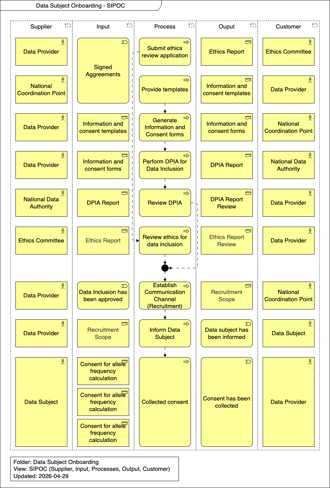

import TOCInline from '@theme/TOCInline';

# Runtime View

This section describes the dynamic behavior and specific scenarios involved in the Data Subject Onboarding process. It outlines the ethical, legal, and operational steps required to ensure that data subjects are properly informed, consented, and onboarded into the federated network in full compliance with privacy regulations.

<TOCInline toc={toc} />

## Overview

## Submit ethics review application

The Data Provider submits the signed agreements and study protocol to the relevant Ethics Committee for official review and approval, generating an Ethics Report.

## Provide templates

The National Coordination Point provides the Data Provider with standardized, legally compliant templates for patient information and consent.

## Generate Information and Consent forms

The Data Provider customizes the provided templates to generate the final information sheets and consent forms specific to their cohort, study, or clinical environment, which are then shared with the National Coordination Point.

## Perform DPIA for Data Inclusion

The Data Provider performs a Data Protection Impact Assessment (DPIA) based on the generated forms to identify, assess, and mitigate any privacy risks associated with processing and sharing the data subjects' sensitive health and genomic data. The resulting DPIA Report is submitted to the National Data Authority.

## Review DPIA

The National Data Authority or relevant supervisory body reviews the submitted DPIA Report to confirm that all data protection risks have been adequately addressed, providing a DPIA Report Review back to the Data Provider.

## Review ethics for data inclusion

The Ethics Committee thoroughly reviews the Ethics Report to ensure that the proposed data inclusion and secondary use of the data subjects' genomic information meet all strict ethical standards, providing an Ethics Report Review to the Data Provider.

## Establish Communication Channel (Recruitment)

Once the data inclusion has been approved (following both DPIA and Ethics reviews), the Data Provider establishes secure communication channels to define the recruitment scope for reaching out to potential data subjects, coordinating this scope with the National Coordination Point.

## Inform Data Subject

Based on the recruitment scope, the Data Provider officially informs the data subject about how their data will be used, stored, and shared within the federated network.

## Collected consent

The Data Subject provides explicit consent, which is collected by the Data Provider. This typically encompasses specific permissions, such as:

- Consent for allele frequency calculation
- Consent for subject-level data query
- Consent for data available through Genome EDIC Secondary Use Framework
