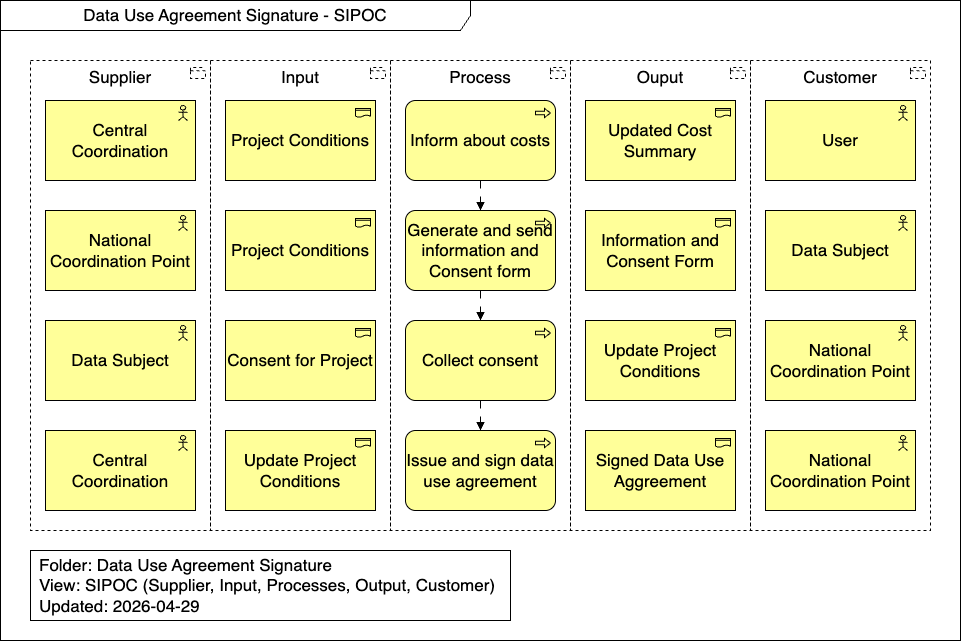

import TOCInline from '@theme/TOCInline';

# Runtime View

This section details the dynamic behavior and specific scenarios involved in the Data Use Agreement Signature process. It outlines the necessary steps for communicating costs, collecting consent, and the final execution of the contract between the involved parties.

<TOCInline toc={toc} />

## Overview

## Inform about costs

Central Coordination reviews the Project Conditions and provides the User with an Updated Cost Summary, ensuring full transparency regarding any financial requirements associated with the project.

## Generate and send information and Consent form

Based on the Project Conditions, the National Coordination Point generates a tailored Information and Consent Form, which is then sent to the Data Subject for their review.

## Collect consent

The Data Subject reviews the information and provides their Consent for Project. This allows the National Coordination Point to collect the consent and produce Updated Project Conditions.

## Issue and sign data use agreement

Using the Updated Project Conditions, Central Coordination issues the final contract and facilitates the signature process, resulting in a Signed Data Use Agreement provided to the National Coordination Point.
