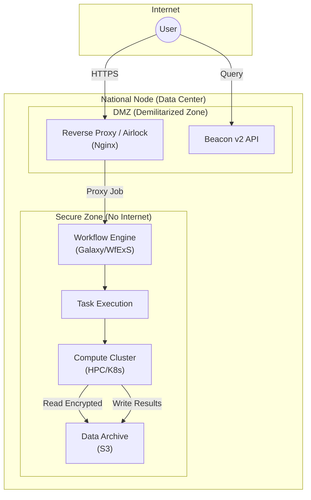

# Deployment View

The deployment architecture respects the **Data Residency** constraints (Constraint L02) by physically separating the Central Services from the National Storage.

## 1. Infrastructure Overview

| Infrastructure Element            | Environment                    | Geography                                       | Responsibility                                    |
| :-------------------------------- | :----------------------------- | :---------------------------------------------- | :------------------------------------------------ |
| **Central Hub (Portal/Registry)** | Cloud                          | Luxembourg (EU Region)                          | Managed by **Genome EDIC**.                       |
| **National Node Infrastructure**  | Regional Cloud / HPC / On-Prem | Country-Specific (e.g., CSC Finland, BSC Spain) | Managed by **Member State**.                      |
| **Network Layer**                 | Public Internet (TLS 1.3)      | Global                                          | Secure encrypted channels over standard internet. |

## 2. Zoned Network Architecture

To satisfy **Data Protection by Design (DPbDD)**, the National Node network is segmented:

| Zone                  | Description                         | Allowed Traffic     | Components                            |
| :-------------------- | :---------------------------------- | :------------------ | :------------------------------------ |
| **Public / DMZ**      | Exposed to the internet.            | HTTPS (443) only.   | Airlock (Proxy), Beacon API, Keycloak |
| **Secure / Internal** | **No internet access** (Airgapped). | Internal Mesh Only. | Compute Cluster, WfExS, Data Archive  |
| **Management**        | Admin access only.                  | SSH/VPN.            | Monitoring, Logging, Key Management   |

## 3. Deployment Diagram

## 3. Node Requirements (The "Starter Kit")

Each Member State is expected to provision the following baseline resources to run the GDI Starter Kit:

- **Orchestrator:** Kubernetes Cluster (v1.28+).
- **Storage:** S3-compatible Object Storage (MinIO or Cloud provider) for Genomic Data (Petabyte scale).
- **Compute:** High-Memory Nodes for Workflow Execution (e.g., 64GB+ RAM for alignment jobs).
- **Security:** HSM or Key Management Service (KMS) for Crypt4GH keys.

## 5. Environment Strategy

To ensure stability and "Five Safes" compliance, we define three environments:

1.  **Development (DEV):** Synthetic data only. Open internet access allowed for developers.
2.  **Staging (TEST):** Mirror of Prod settings (Airgapped). Synthetic data. Used for verifying RO-Crates.
3.  **Production (PROD):** Real Sensitive Data. Strict Airgap. **No Internet**.
