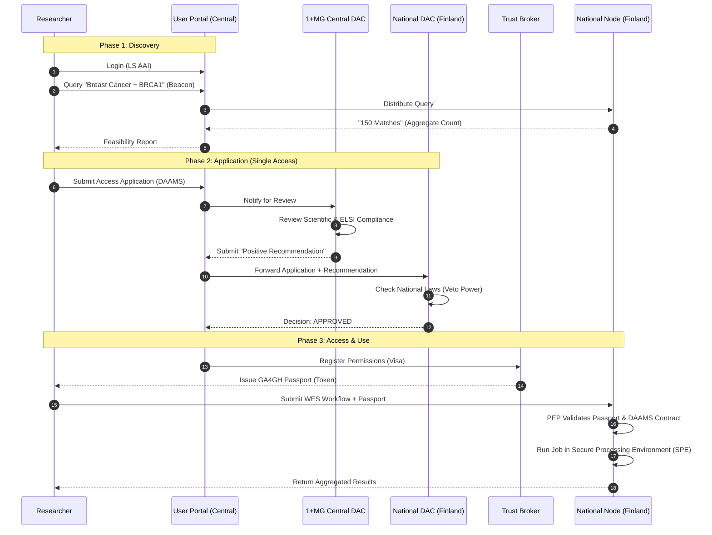
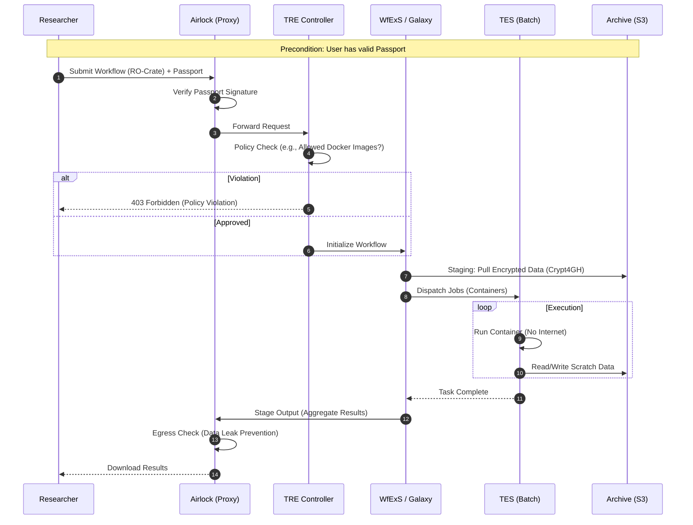

# Runtime View

## 1. Data Access Workflow (The "Single Access Principle")

This scenario describes the primary flow for a researcher to discover, request, and access genomic data across borders, illustrating the interplay between central governance and local sovereignty[^1] [^2].

### Steps Description

1.  **Discovery (Feasibility):** The researcher authenticates via the **Life Science AAI** and queries the central **Beacon** network. The Portal aggregates counts from National Nodes without exposing individual data.
2.  **Application:** The researcher selects interesting cohorts and submits a **Single Access Application** via the central **DAAMS** (Data Access Application Management System).
3.  **Central Review:** The **1+MG Central DAC** reviews the application for scientific excellence and general ethical compliance. They issue a recommendation.
4.  **Local Veto/Approval:** The recommendation is forwarded to the **National DACs** (Data Holders). Each country retains sovereignty and can **veto** the access based on national legislation.
5.  **Provisioning:** If approved by all (or a subset of) nodes, the corresponding permissions are minted as **GA4GH Visas** by the **Trust Broker**.
6.  **Secure Processing:** The researcher receives a **GA4GH Passport** containing these Visas. They submit a compute request (WES) to the National Node. The Node's **Policy Enforcement Point (PEP)** validates the Passport against the local access control list before executing the workflow in the isolated **SPE**.

## 2. Secure Processing Workflow (TRE-FX)

This scenario details the execution phase (`ujGdi08`), focusing on how the **Secure Processing Environment (SPE)** ensures isolation while allowing external analysis[^2] [^3].

**Quality Goals:** Security (Isolation), Interoperability (WES).

### Steps Description

1.  **Submission:** The researcher submits a workflow package (**RO-Crate**) and their **Passport** to the **Airlock**. Direct access to the compute cluster is blocked.
2.  **Validation:** The **Airlock** verifies the Passport's cryptographic signature. The **TRE Controller** checks the workflow against local policies (e.g., "Is this Docker image on the allow-list?").
3.  **Orchestration:** The **WfExS** engine orchestrates the steps. It pulls the required genomic data from the **Archive** (which is stored encrypted).
4.  **Execution (Isolation):** Individual tasks are sent to **TES**. The compute nodes have **no internet access** to prevent unauthorized data exfiltration.
5.  **Egress:** Final results are sent back to the Airlock. An **Egress Check** (automated or manual) ensures no individual-level data is leaving the boundary.

[^1]: B1MG Deliverable D2.4 - Report on data access and governance framework. (https://zenodo.org/records/8411102)

[^2]: GDI Deliverable D8.8 - Evaluation of distributed analysis and federated learning infrastructure solutions and recommendations for adoption. (https://zenodo.org/records/10887366)

[^3]: GDI - Pillar III User Journeys. (https://zenodo.org/records/17661188)
