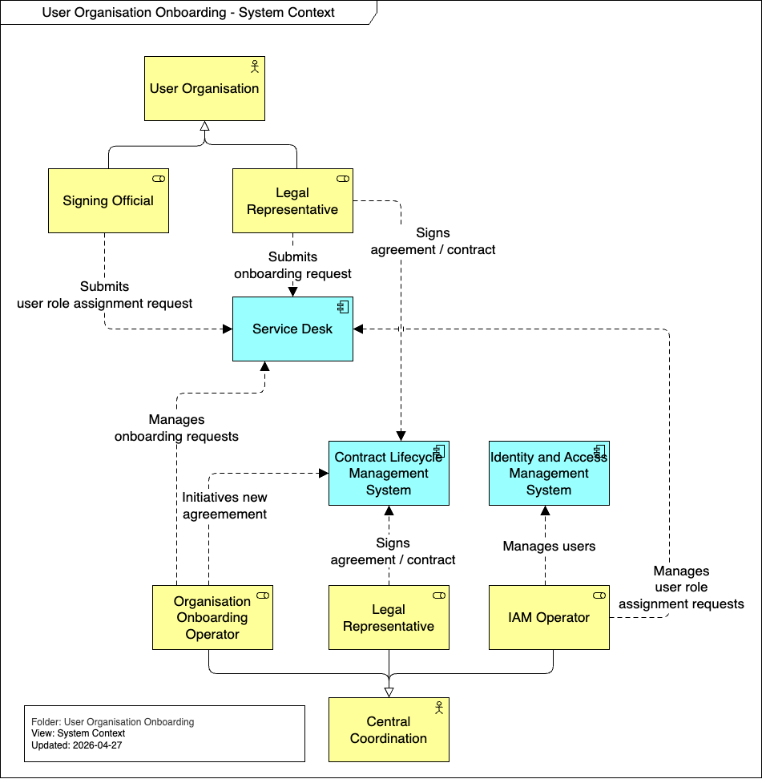

# Building Block View

This section describes the static decomposition of the system components involved in the User Organisation Onboarding process. It maps the operational steps identified in the SIPOC diagram to the underlying technical building blocks.

## Whitebox Overall System

This level describes the main components required to support the onboarding workflows, managing registrations, legal agreements, and identity verification.

To support the processes outlined in the runtime view—such as registration, vetting, contract signing, and user assignment—the system must be decomposed into functional components that handle distinct responsibilities, ensuring modularity, security, and compliance.

### Contained Building Blocks

1. **Service Desk / CRM System**
   - **Responsibility:** Serves as the primary interface and management tool for User Organisations to submit registration details. It acts as the "Organisation Registry" by securely storing organisational profiles, metadata, and status. It coordinates the overall workflow and notifications, but integrates with specialized systems for contract execution and identity provisioning.

2. **Contract Lifecycle Management System**
   - **Responsibility:** Manages the generation, distribution, and signing of legal documents, including the Joint Controllership agreement and healthcare reuse contracts. It provides secure, compliant e-signing capabilities, tracks signature status, and maintains an immutable audit trail of all executed agreements.

3. **Identity and Access Management System**
   - **Responsibility:** Manages authentication, authorization, and user records. Once an organisation is vetted and contracts are signed, the IAM service provisions identities and manages role-based access control (RBAC) to ensure only authorized personnel can request access.

### Important Interfaces

- **User Organisation - Service Desk / CRM System:** Secure web interface for submitting registration data and communicating with Central Coordination.
- **User Organisation - Contract Lifecycle Management System:** Secure interface or email-driven workflow for authorized representatives to review and digitally sign legal agreements.
- **Central Coordination - Service Desk / CRM System:** Administrative dashboard for reviewing records, vetting organisations, and tracking overall onboarding progress.
- **Service Desk / CRM System - Contract Lifecycle Management System:** API integration to automatically trigger contract generation upon successful vetting, and to sync signature completion status back to the CRM workflow.
- **Service Desk / CRM System - Identity and Access Management System:** Integration via API to automatically create identities and map roles once vetting is complete and contracts are fully signed.
