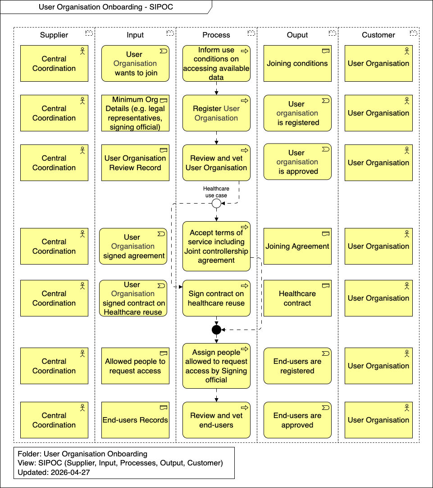

import TOCInline from '@theme/TOCInline';

# Runtime View

This section details the dynamic behavior and scenarios involved in the User Organisation Onboarding process. It outlines the step-by-step workflows and interactions required to successfully register and verify a user organisation for data access within the network.

<TOCInline toc={toc} />

## Overview

## Inform use conditions on accessing available data

The Central Coordination provides the necessary documentation and terms that outline the prerequisites and conditions for joining the network. This step ensures that prospective user organisations understand their obligations, legal requirements, and the criteria they must meet before initiating the formal registration process.

## Register User Organisation

A representative from the prospective user organisation initiates the onboarding process by submitting their registration details. This includes providing essential organizational information such as the legal entity name, designated legal representatives, and the signing official who will hold authority over data access requests.

## Review and vet User Organisation

Once the registration is submitted, the Central Coordination reviews the provided details. This vetting process verifies the legitimacy of the organisation, confirming that it meets the required scientific, ethical, and legal standards to operate as an authorized entity within the federated network.

## Accept terms of service including Joint controllership agreement

After successful vetting, the user organisation must formally agree to the network's terms of service. Crucially, this step involves accepting the Joint Controllership agreement, which legally defines the shared responsibilities for data protection and processing between the user organisation and the data providers.

## Sign contract on healthcare reuse

If the user organisation intends to access and process data specifically for healthcare use cases, an additional, specialized contract must be signed. This ensures compliance with stricter regulations surrounding clinical data.

## Assign people allowed to request access by Signing official

With the organisation fully onboarded, the designated signing official is granted the authority to manage personnel. They assign and authorize specific individuals (such as researchers or data scientists) within their organisation who are permitted to submit access requests for datasets.

## Review and vet end-users

The final step involves reviewing the individuals assigned by the signing official. The Central Coordination or an authorized body vets these end-users to ensure they hold the necessary credentials, affiliations, and training required to securely access and analyze sensitive data within the network.
